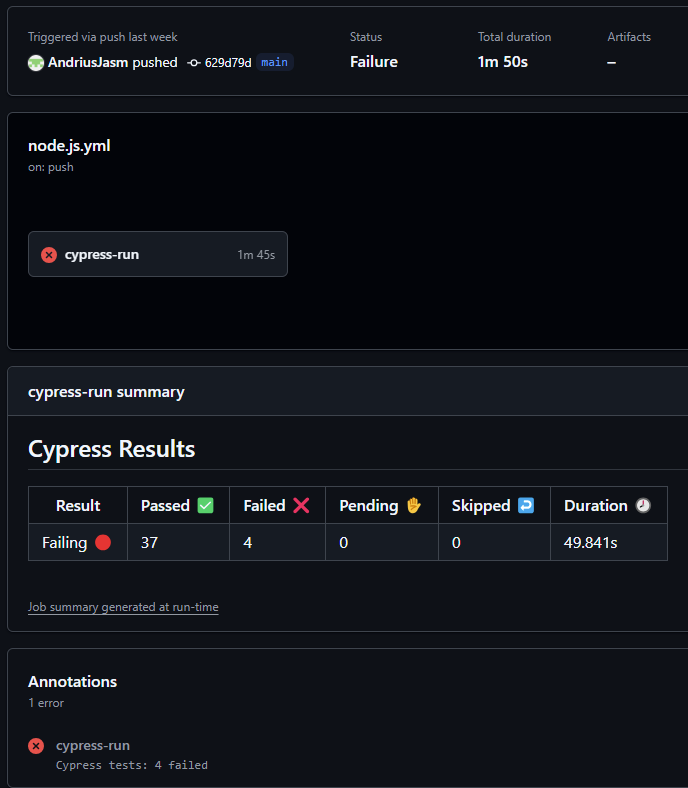

# Test Scenarios and Test Cases for SweetShop Website

Automated end-to-end testing for the **Sweet Shop** web application using **Cypress**.

**Live App**: [**Sweet Shop**](https://sweetshop.netlify.app)

---

## Description

The project includes automated Cypress tests that verify the core functionalities of the **Home pge**, **Navigation Bar**, **Sweets**, **About**, **Login**, **Account**, and **Basket** pages.

These features are thoroughly tested using:

-   **7 Test Scenarios (TS)**
-   **41 Test Cases (TC)**

All Test Scenarios (TS) and Test Cases (TC) are described in the [**TestCases.md**](/TestCases.md) file.

---

## Folder Structure

<pre> SWEETSHOP_PROJECT 
├── .github/ 
│ └── workflows/ # GitHub Actions workflow for CI 
├── cypress/ 
│ ├── e2e/ # End-to-end test specs 
│ │ ├── about.cy.js 
│ │ ├── account.cy.js 
│ │ ├── basket.cy.js 
│ │ ├── home.cy.js
│ │ ├── login.cy.js 
│ │ ├── navbar.cy.js 
│ │ └── sweets.cy.js 
│ ├── fixtures/ # Test data (example.json) 
│ └── support/ # Custom Cypress commands 
│   ├── commands.js 
│   └── e2e.js # Cypress setup 
├── node_modules/ # Dependencies 
├── .gitignore # Git ignore file 
├── cypress.config.js # Cypress configuration 
├── package-lock.json # Dependency lockfile 
├── package.json # Dependencies & scripts
├── README.md # Project description  
└── TestCases.md # Test cases documentation </pre>

---

## Installation

### 1️ Prerequisites

```
Node.js
npm
```

### 2️ Clone the Repository

```
git clone https://github.com/AndriusJasm/SweetShop---Project
```

### 3️ Install Dependencies

```
npm install
```

---

## Running Tests

### Run Cypress in UI Mode

```
npm run cy:open
```

### Run Cypress in CLI Mode

```
npm run cy:run
```

---

## Cypress Commands

| Command                               | Purpose                     |
| ------------------------------------- | --------------------------- |
| `cy.addRandomItemsToBasket(min, max)` | Add random number of sweets |
| `cy.visitMainPage()`                  | Visit homepage              |
| `cy.visitSweetsPage()`                | Visit sweets catalog        |
| `cy.visitAboutPage()`                 | Visit about page            |
| `cy.visitLoginPage()`                 | Go to login                 |
| `cy.visitBasketPage()`                | Go to basket                |
| `cy.addItemToBasket(index)`           | Add a specific sweet        |

---

## CI/CD with GitHub Actions

The workflow is triggered on push and pull requests to the main branch.  
The GitHub Actions workflow **(.github/workflows/node.js.yml)** performs the following steps:

-   Checks out the repository using actions/checkout@v4.
-   Installs dependencies using npm install.
-   Sets up Node.js version 18.
-   Runs Cypress tests for end-to-end testing.
-   Executes Cypress tests using cypress-io/github-action@v6.

---

## Screenshot of Testing Results



---

## License

MIT License © 2025 Your Name.

---

## Author

Andrius Jasmontas
